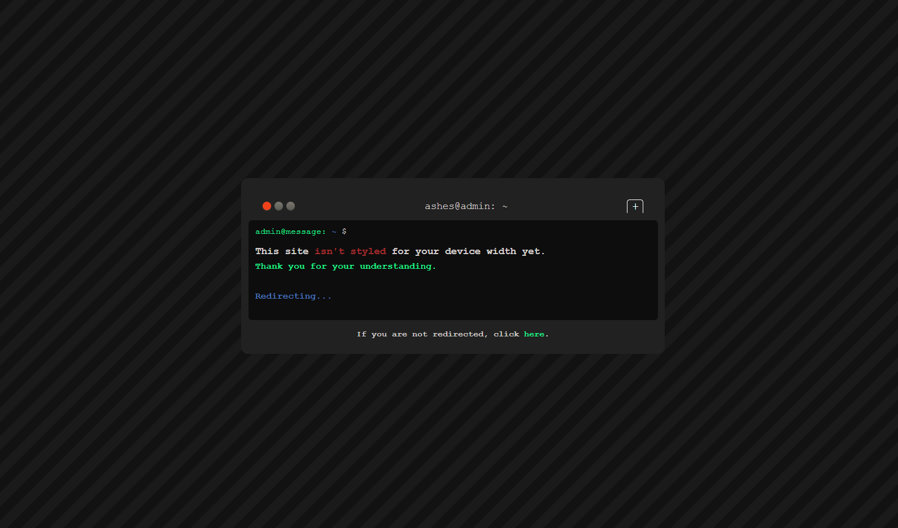

# Terminal-Themed Redirect Site

A stylish, dark terminal-themed website that redirects users based on the `url` parameter in the query string. The design mimics a terminal interface and provides a sleek, professional experience during the redirection process. If the user is not redirected within a few seconds, they are prompted to manually proceed by clicking a link.



## Demo

You can view the live demo of the site here: [Terminal Redirect Site](https://ashesbloom.github.io/redirect-device-width/)

## Features

- **Terminal-Themed UI**: Inspired by a terminal environment with toolbar buttons and a command-line prompt.
- **Dynamic Redirection**: Automatically redirects to the specified `url` parameter after a brief delay.
- **Graceful Fallback**: If the redirection URL is missing or incorrect, an alert is triggered.
- **Responsive Prompt**: Displays a message informing users about device width limitations and a smooth redirect experience.
- **Fallback Link**: If the automatic redirect fails, users can manually proceed by clicking the provided link.

## Installation

To run this project locally, follow these steps:

1. Clone the repository:
    ```bash
    git clone https://github.com/ashesbloom/redirect-device-width.git
    ```

2. Open the project directory:
    ```bash
    cd redirect-device-width
    ```

3. Open `index.html` in your preferred browser to view the site locally.

## How It Works

- The site extracts the `url` parameter from the current page's URL and attempts to redirect after a 4-second delay.
- If no `url` parameter is provided or if there’s an issue, an error message is displayed.
- The terminal UI is designed to give users a retro feel, complete with a blinking cursor and prompt-like feedback.

## Usage

To use this redirect site, append your desired destination URL as a query parameter like this:
```bash
  https://ashesbloom.github.io/redirect-device-width/?url=https://yourdestination.com
```
## Technologies Used

- **HTML5**
- **CSS3** (located in `./public/stylesheet/style.css`)
- **JavaScript** (for handling redirection logic)
